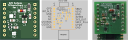

# Temperature, Humidity, Ambient Light Monitoring
ifdef::env-name[:relfilesuffix: .adoc]

The goal of this project is to design a temperature and humidity monitoring system for indoor home usage.

## Specifications
. Monitor the temperature (T) in deg celsius with accuracy of better than 1%.
. Monitor the humidity (RH) in %RH (relative humidity) with accuracy of better than 5%.
. Monitor the ambient light in relative lux (LUX) with respect to dark.
. Capable of recording the T, RH, LUX at least once every 30 seconds.
. Records T, RH, LUX in a database.
. Presents T, RH, LUX data as a time-series via a web-interface.
. The web-interface is accesible atleast within the intra-net.

## System Design
A block diamgram of the system is shown in the figure below.

## Hardware Design
The sensor board has Sensirion SHTC3 temperature and humidity sensor.
The board is designed to fit on top or under of the Raspberry Pi Pico W (PicoW).

## Software Design

### Monitoring Server
The monitoring server is deployed on a Raspberry Pi 400.
The sensor node communicates to a Python Django based web-app which can receive data on port 8080.
The web app stores data in a SQLite database. The database backup is scheduled for everyday on a internal network attached storage.

#### Web API Specifications

Web API specifications are documented in xref:SensorNetwork/WebAPISpecifications.adoc[Web API Specifications]
# Web API Specifications

## Sensor Node
### Send Monitoring Data Point
* Sensor Node sends the data with a `<POST>` request.
* Endpoint: `/thlmonitor/sensor_data`
* Send data in as Python dictionary. Individual fields are listed below:
** `location` sent as a tuple of grid co-ordinates as per the sensor grid specifications
** `timestamp` sent as a of tuple of `time.localtime()`
** Temperature `T` sent as a number with one decimal precision.
** Relative Humidity `RH` sent as a an integer number between [0, 100].
** Ambient Light intensity `LUX` sent as a number with one decimal precision.

For example:
Ground floor, living room
[source, json] 
{"location":'0E4',"timestamp":(2023, 1, 15, 16, 47, 39, 6, 15),"T":23.5,"RH":50.5,"LUX":34.2}
OR
{"location":'GE4',"timestamp":(2023, 1, 15, 16, 47, 39, 6, 15),"T":23.5,"RH":50.5,"LUX":34.2}

First floor, N Office room
[source, json]
{"location":'1A6',"timestamp":(2023, 1, 15, 16, 47, 39, 6, 15),"T":23.5,"RH":50.5,"LUX":34.2}
OR
{"location":'FA6',"timestamp":(2023, 1, 15, 16, 47, 39, 6, 15),"T":23.5,"RH":50.5,"LUX":34.2}

### Get Current Time from Server
* Sensor requests current time with a `<GET>` request.
* Endpoint: `/thlmonitor/sensor_data`
** Data sent as number of seconds from epoch. 

### Example Sensor Grid Specifications

image::SensorNetwork/figures/SensorGridSpecification.svg[Sensor Grid for a Typical House]

## User Front End for Home Monitoring
[TBD]

### Sensor Node
Programmers model for the sensor board is shown in following figure:

image::SensorNetwork/figures/FirmwareProgrammersModel.svg[SensorBoard connections to Pico W]

* Each sensor node consists of a PicoW as controller and THL sensor board.
* Each sensor node has a location tag to uniquely identify the location.
* PicoW sets up time of internal RTC clock
* PicoW uses MicroPython with urequest library
* Each of the Sensirion T/RH and LiteOn Ambient light sensor communicates with PicoW via I2C interface.
* The sensor node acquires T, RH and LUX data every 30 seconds and puts it in a queue.
* The node attempts to send the data in queue to the server in JSON format specified above.
If successful the datapoint is dequeued, else attempted again.
