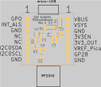
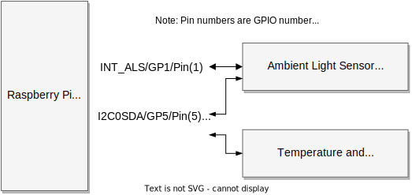

# Temperature, Humidity, Ambient Light Monitoring
ifdef::env-name[:relfilesuffix: .adoc]

The goal of this project is to design a temperature and humidity monitoring system for indoor home usage.

## Specifications
. Monitor the temperature (T) in deg celsius with accuracy of better than 1%.
. Monitor the humidity (RH) in %RH (relative humidity) with accuracy of better than 5%.
. Monitor the ambient light in relative lux (LUX) with respect to dark.
. Capable of recording the T, RH, LUX at least once every 30 seconds.
. Records T, RH, LUX in a database.
. Presents T, RH, LUX data as a time-series via a web-interface.
. The web-interface is accesible atleast within the intra-net.

## System Design
A block diamgram of the system is shown in the figure below.

image::figures/SystemBlockDiagram.svg[Home Monitoring Systems Block Diagram]

## Hardware Design
The sensor board has Sensirion SHTC3 temperature and humidity sensor.
The board is designed to fit on top or under of the Raspberry Pi Pico W (PicoW).

## Software Design

### Monitoring Server
The monitoring server is deployed on a Raspberry Pi 400.
The sensor node communicates to a Python Flask based web-app which can receive data on port 6161.
The web app stores data in a SQLite database. The database backup is scheduled for everyday on a internal network attached storage.

#### Web API Specifications

Web API specifications are documented in xref:WebAPISpecifications.adoc[Web API Specifications]

* Receive data in JSON format, `<POST>`

[source, json]
{
    "location":"livingroom",
    "time":"2018-12-10T13:45:00.000Z",
    "T":23.5,"RH":65,"LUX":20
}

* Send current time as integer seconds since Epoch, `<GET>`
* `1673284915` secs corresponds to `09-Jan-2023, 17:21:55`

[source, python]
"{"secs":1673284915}"

### Sensor Node
Programmers model for the sensor board is shown in following figure:

* Each sensor node consists of a PicoW as controller and THL sensor board.
* Each sensor node has a location tag to uniquely identify the location.
* PicoW sets up time of internal RTC clock
* PicoW uses MicroPython with urequest library
* Each of the Sensirion T/RH and LiteOn Ambient light sensor communicates with PicoW via I2C interface.
* The sensor node acquires T, RH and LUX data every 30 seconds and puts it in a queue.
* The node attempts to send the data in queue to the server in JSON format specified above.
If successful the datapoint is dequeued, else attempted again.
