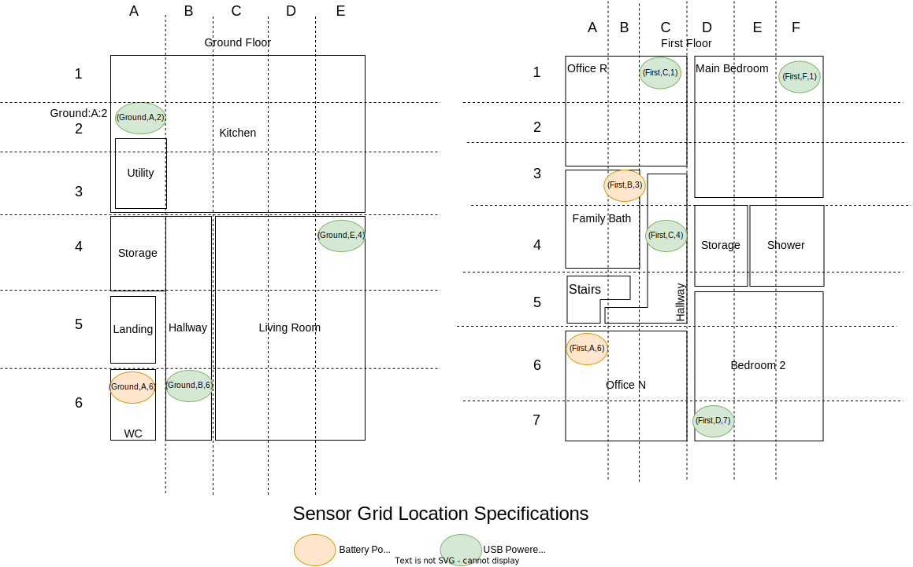

# Web API Specifications

## Sensor Node
### Send Monitoring Data Point
* Sensor Node sends the data with a `<POST>` request.
* Send data in as Python dictionary. Individual fields are listed below:
** `location` sent as a tuple of grid co-ordinates as per the sensor grid specifications
** `timestamp` sent as a of tuple of `time.localtime()`
** Temperature `T` sent as a number with one decimal precision.
** Relative Humidity `RH` sent as a an integer number between [0, 100].
** Ambient Light intensity `LUX` sent as a number with one decimal precision.

For example:
[source, json]
{"location":'(Ground,A,2)',"timestamp":(2023, 1, 15, 16, 47, 39, 6, 15),"T":23.5,"RH":50.5,"LUX":34.2}

### Get Current Time from Server
* Sensor requests `time` with a `<GET>` request at endpoint `/currentime`
** Data received as tuple of time.localtime()

### Sensor Grid Specifications

## User Front End for Home Monitoring

